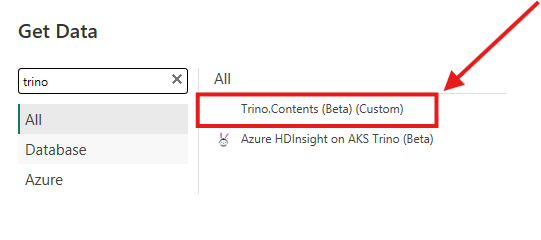
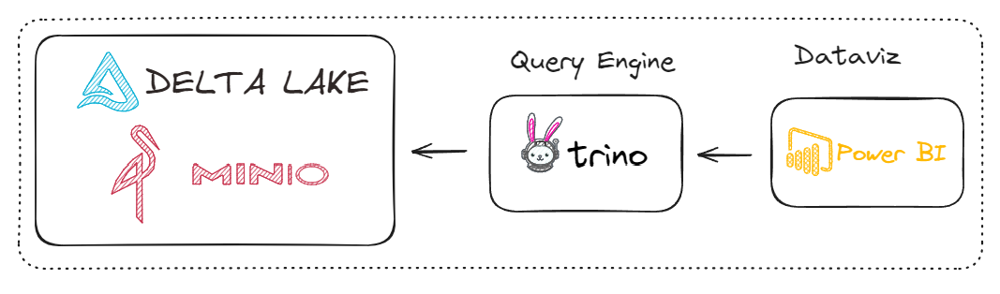

# Conector Trino para Power BI
## Descrição
O conector será utilizado para conectar o Power BI no Trino e ser capaz de acessar todos os seus catálogos que o Trino enxerga.

Se tudo acontecer conforme o esperado, será adicionado um novo conector do Trino no Power BI.

## Arquitetura

## Pré-requisitos
* Trino
* Power BI
* Power Query SDK (Extensão VS Code)

## Etapas

1 - Crie uma pasta em documentos com o nome Power BI Desktop\Custom Connectors

2 - Dentro da pasta criada utilize os arquivos deste repositório.

3 - Na configurações do Power BI, permita configuração com qualquer conector. Veja como fazer isso no [link](https://learn.microsoft.com/en-us/power-bi/connect-data/desktop-connector-extensibility#certified-connectors).

4 - Instale o Power Query SDK

## Vídeo tutorial

## Referências
https://github.com/CreativeDataEU/PowerBITrinoConnector

## Developer
| Desenvolvedor      | LinkedIn                                   | Email                        | Portfólio                              |
|--------------------|--------------------------------------------|------------------------------|----------------------------------------|
| Wallace Camargo    | [LinkedIn](https://www.linkedin.com/in/wallace-camargo-35b615171/) | wallacecpdg@gmail.com        | [Portfólio](https://wlcamargo.github.io/)   |
